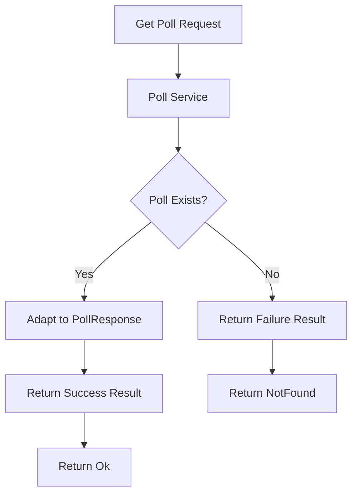

# Updating Poll Service to Use Result Pattern

## Original Implementation
Previously, the service returned nullable Poll:

```csharp
public async Task<Poll?> GetAsync(int id, CancellationToken cancellationToken = default) =>
    await _context.Polls.FindAsync(id, cancellationToken);
```

## Poll Errors Definition
Created a dedicated errors class for Poll-related errors:

```csharp
public static class PollErrors
{
    public static readonly Error PollNotFound = new(
        "Poll.NotFound",
        "No Poll Was Found With The Given Id"
    );
}
```

## Updated Service Interface
Modified the interface to use Result pattern:

```csharp
public interface IPollService
{
    Task<IEnumerable<Poll>> GetAllAsync(CancellationToken cancellationToken = default);
    Task<Result<PollResponse>> GetAsync(int id, CancellationToken cancellationToken = default);
    Task<Poll> AddAsync(Poll poll, CancellationToken cancellationToken = default);
    Task<bool> UpdateAsync(int id, Poll poll, CancellationToken cancellationToken = default);
    Task<bool> DeleteAsync(int id, CancellationToken cancellationToken = default);
    Task<bool> TooglePublishStatusAsync(int id, CancellationToken cancellationToken = default);
}
```

## Updated Service Implementation
```csharp
public async Task<Result<PollResponse>> GetAsync(
    int id, 
    CancellationToken cancellationToken = default)
{
    var poll = await _context.Polls.FindAsync(id, cancellationToken);
    
    return poll is not null 
        ? Result.Success(poll.Adapt<PollResponse>())
        : Result.Failure<PollResponse>(PollErrors.PollNotFound);
}
```

## Controller Update
Changed from null checking to Result pattern:

```csharp
[HttpGet("{id}")]
public async Task<IActionResult> Get(
    [FromRoute] int id,
    CancellationToken cancellationToken)
{
    var result = await _pollService.GetAsync(id, cancellationToken);
    
    return result.IsSuccess 
        ? Ok(result.Value) 
        : NotFound(result.Error);
}
```

## Flow Diagram



## Key Improvements

1. **Type Safety**
   - Removed nullable types
   - Clear success/failure states
   - Domain model separation

2. **Error Handling**
   - Centralized error definitions
   - Consistent error messages
   - Better error details

3. **Response Mapping**
   - Direct mapping to response DTOs
   - Cleaner controller logic
   - Better separation of concerns

4. **Architecture**
   - Service returns response DTOs
   - Controller handles HTTP responses
   - Clear responsibility boundaries


