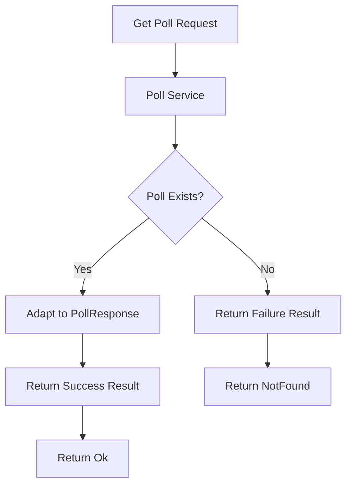
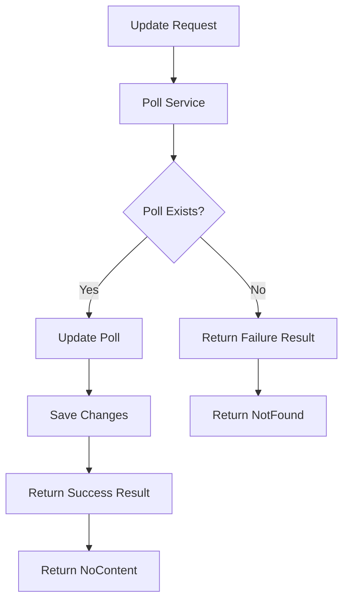

# Updating Poll Service to Use Result Pattern

## Original Implementation
Previously, the service returned nullable Poll:

```csharp
public async Task<Poll?> GetAsync(int id, CancellationToken cancellationToken = default) =>
    await _context.Polls.FindAsync(id, cancellationToken);
```

## Poll Errors Definition
Created a dedicated errors class for Poll-related errors:

```csharp
public static class PollErrors
{
    public static readonly Error PollNotFound = new(
        "Poll.NotFound",
        "No Poll Was Found With The Given Id"
    );
}
```

## Updated Service Interface
Modified the interface to use Result pattern:

```csharp
public interface IPollService
{
    Task<IEnumerable<Poll>> GetAllAsync(CancellationToken cancellationToken = default);
    Task<Result<PollResponse>> GetAsync(int id, CancellationToken cancellationToken = default);
    Task<Poll> AddAsync(Poll poll, CancellationToken cancellationToken = default);
    Task<bool> UpdateAsync(int id, Poll poll, CancellationToken cancellationToken = default);
    Task<bool> DeleteAsync(int id, CancellationToken cancellationToken = default);
    Task<bool> TooglePublishStatusAsync(int id, CancellationToken cancellationToken = default);
}
```

## Updated Service Implementation
```csharp
public async Task<Result<PollResponse>> GetAsync(
    int id, 
    CancellationToken cancellationToken = default)
{
    var poll = await _context.Polls.FindAsync(id, cancellationToken);
    
    return poll is not null 
        ? Result.Success(poll.Adapt<PollResponse>())
        : Result.Failure<PollResponse>(PollErrors.PollNotFound);
}
```

## Controller Update
Changed from null checking to Result pattern:

```csharp
[HttpGet("{id}")]
public async Task<IActionResult> Get(
    [FromRoute] int id,
    CancellationToken cancellationToken)
{
    var result = await _pollService.GetAsync(id, cancellationToken);
    
    return result.IsSuccess 
        ? Ok(result.Value) 
        : NotFound(result.Error);
}
```

## Flow Diagram



## Key Improvements

1. **Type Safety**
   - Removed nullable types
   - Clear success/failure states
   - Domain model separation

2. **Error Handling**
   - Centralized error definitions
   - Consistent error messages
   - Better error details

3. **Response Mapping**
   - Direct mapping to response DTOs
   - Cleaner controller logic
   - Better separation of concerns

4. **Architecture**
   - Service returns response DTOs
   - Controller handles HTTP responses
   - Clear responsibility boundaries


# Updating Poll Update Operation with Result Pattern

## Interface Update
Modified `IPollService` to use Result pattern for Update:

```csharp
public interface IPollService
{
    Task<IEnumerable<Poll>> GetAllAsync(CancellationToken cancellationToken = default);
    Task<Result<PollResponse>> GetAsync(int id, CancellationToken cancellationToken = default);
    Task<Poll> AddAsync(Poll poll, CancellationToken cancellationToken = default);
    Task<Result> UpdateAsync(int id, PollRequest request, CancellationToken cancellationToken = default);
    Task<bool> DeleteAsync(int id, CancellationToken cancellationToken = default);
    Task<bool> TooglePublishStatusAsync(int id, CancellationToken cancellationToken = default);
}
```

## Service Implementation Evolution

### Previous Implementation
```csharp
public async Task<bool> UpdateAsync(int id, Poll poll, CancellationToken cancellationToken = default)
{
    var currentPoll = await GetAsync(id, cancellationToken);
    if (currentPoll is null)
        return false;
        
    currentPoll.Title = poll.Title;
    currentPoll.Summary = poll.Summary;
    currentPoll.StartsAt = poll.StartsAt;
    currentPoll.EndsAt = poll.EndsAt;
    
    await _context.SaveChangesAsync(cancellationToken);
    return true;
}
```

### Updated Implementation
```csharp
public async Task<Result> UpdateAsync(int id, PollRequest request, CancellationToken cancellationToken = default)
{
    var currentPoll = await _context.Polls.FindAsync(id, cancellationToken);
    
    if (currentPoll is null)
        return Result.Failure(PollErrors.PollNotFound);
        
    currentPoll.Title = request.Title;
    currentPoll.Summary = request.Summary;
    currentPoll.StartsAt = request.StartsAt;
    currentPoll.EndsAt = request.EndsAt;
    
    await _context.SaveChangesAsync(cancellationToken);
    return Result.Success();
}
```

## Controller Evolution

### Previous Implementation
```csharp
[HttpPut("{id}")]
public async Task<IActionResult> Update(
    [FromRoute] int id, 
    [FromBody] PollRequest request,
    CancellationToken cancellationToken)
{
    var isUpdated = await _pollService.UpdateAsync(id, request.Adapt<Poll>(), cancellationToken);
    
    if (!isUpdated)
        return NotFound();
        
    return NoContent();
}
```

### Updated Implementation
```csharp
[HttpPut("{id}")]
public async Task<IActionResult> Update(
    [FromRoute] int id, 
    [FromBody] PollRequest request,
    CancellationToken cancellationToken)
{
    var result = await _pollService.UpdateAsync(id, request, cancellationToken);
    
    return result.IsSuccess 
        ? NoContent() 
        : NotFound(result.Error);
}
```

## Flow Diagram



## Key Improvements

1. **Better Error Handling**
   - Replaced boolean returns with Result pattern
   - Clear error messages with PollErrors
   - Consistent error response structure

2. **Simplified Data Flow**
   - Direct use of EF Core Find method
   - No unnecessary mapping in service
   - Cleaner controller logic

3. **Input Handling**
   - Service now accepts PollRequest directly
   - No unnecessary domain model conversion
   - Better separation of concerns

4. **Response Types**
   - Non-generic Result for operations without return data
   - Consistent HTTP status codes
   - Proper error details in responses


# Updating Update Method to Use Result Pattern

## Interface Changes
The interface previously had the update method return a bool and take the domain model as a parameter. We changed it to return Result with no generic type since we don't need to return a value, and changed the parameter to take PollRequest directly:

```csharp
public interface IPollService
{
    Task<IEnumerable<Poll>> GetAllAsync(CancellationToken cancellationToken = default);
    Task<Result<PollResponse>> GetAsync(int id, CancellationToken cancellationToken = default); 
    Task<Poll> AddAsync(Poll poll, CancellationToken cancellationToken = default);
    Task<Result> UpdateAsync(int id, PollRequest request, CancellationToken cancellationToken = default);
    Task<bool> DeleteAsync(int id, CancellationToken cancellationToken = default);
    Task<bool> TooglePublishStatusAsync(int id, CancellationToken cancellationToken = default);
}
```

## Service Implementation 
The update method previously returned bool and used GetAsync to find the poll. We modified it to use EF Core FindAsync directly and return Result:

### Previous Version
```csharp
public async Task<bool> UpdateAsync(int id, Poll poll, CancellationToken cancellationToken = default)
{
    var currentPoll = await GetAsync(id, cancellationToken);
    if(currentPoll is null)
        return false;
    
    currentPoll.Title = poll.Title;
    currentPoll.Summary = poll.Summary;
    currentPoll.StartsAt = poll.StartsAt;
    currentPoll.EndsAt = poll.EndsAt;
    
    await _context.SaveChangesAsync(cancellationToken);
    return true;
}
```

### New Version
```csharp
public async Task<Result> UpdateAsync(int id, PollRequest request, CancellationToken cancellationToken = default)
{
    var currentPoll = await _context.Polls.FindAsync(id, cancellationToken);
    if(currentPoll is null)
        return Result.Failure(PollErrors.PollNotFound);
        
    currentPoll.Title = request.Title;
    currentPoll.Summary = request.Summary;
    currentPoll.StartsAt = request.StartsAt;
    currentPoll.EndsAt = request.EndsAt;
    
    await _context.SaveChangesAsync(cancellationToken);
    return Result.Success();
}
```

## Controller Updates
The controller was updated to handle the Result pattern instead of boolean checks:

### Previous Version  
```csharp
[HttpPut("{id}")]
public async Task<IActionResult> Update([FromRoute] int id, [FromBody] PollRequest request, CancellationToken cancellationToken)
{
    var isUpdated = await _pollService.UpdateAsync(id, request.Adapt<Poll>(), cancellationToken);
    
    if(!isUpdated)
        return NotFound();
    return NoContent();
}
```

### New Version
```csharp
[HttpPut("{id}")]
public async Task<IActionResult> Update([FromRoute] int id, [FromBody] PollRequest request, CancellationToken cancellationToken)
{
    var result = await _pollService.UpdateAsync(id, request, cancellationToken);
    return result.IsSuccess ? NoContent() : NotFound(result.Error);
}
```
