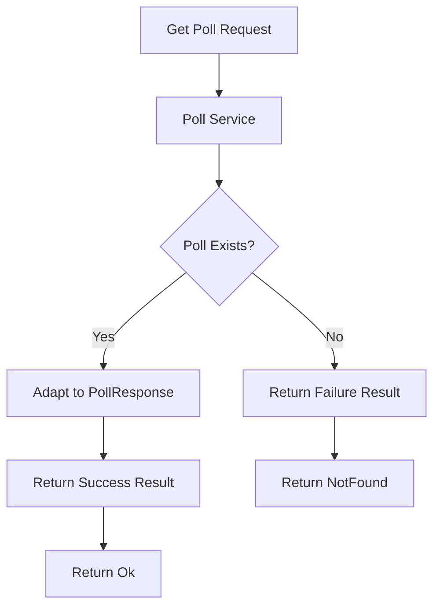
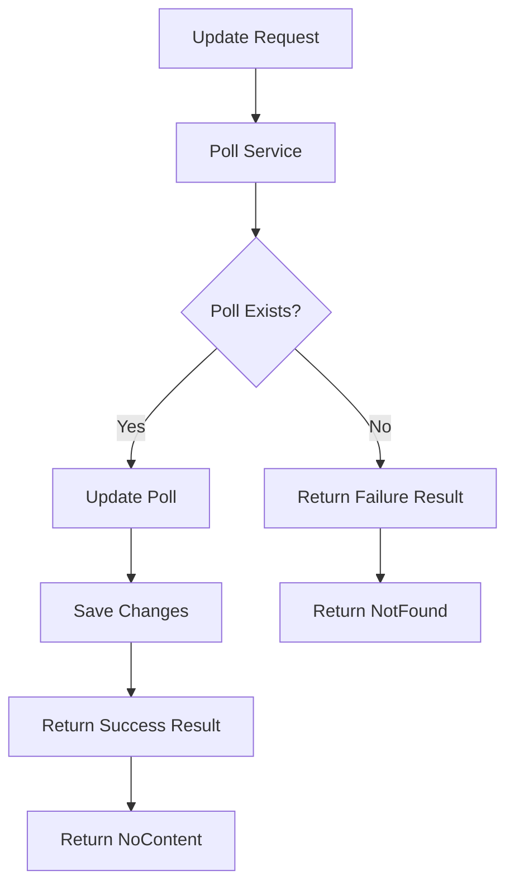
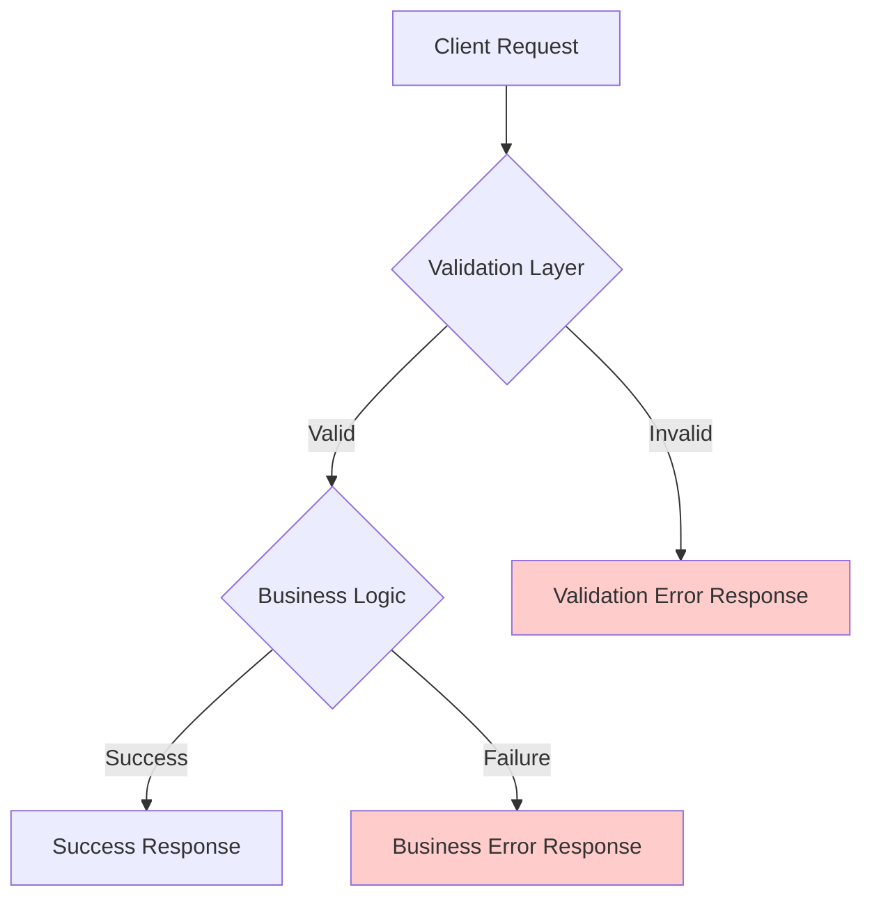

# Updating Poll Service to Use Result Pattern

## Original Implementation
Previously, the service returned nullable Poll:

```csharp
public async Task<Poll?> GetAsync(int id, CancellationToken cancellationToken = default) =>
    await _context.Polls.FindAsync(id, cancellationToken);
```

## Poll Errors Definition
Created a dedicated errors class for Poll-related errors:

```csharp
public static class PollErrors
{
    public static readonly Error PollNotFound = new(
        "Poll.NotFound",
        "No Poll Was Found With The Given Id"
    );
}
```

## Updated Service Interface
Modified the interface to use Result pattern:

```csharp
public interface IPollService
{
    Task<IEnumerable<Poll>> GetAllAsync(CancellationToken cancellationToken = default);
    Task<Result<PollResponse>> GetAsync(int id, CancellationToken cancellationToken = default);
    Task<Poll> AddAsync(Poll poll, CancellationToken cancellationToken = default);
    Task<bool> UpdateAsync(int id, Poll poll, CancellationToken cancellationToken = default);
    Task<bool> DeleteAsync(int id, CancellationToken cancellationToken = default);
    Task<bool> TooglePublishStatusAsync(int id, CancellationToken cancellationToken = default);
}
```

## Updated Service Implementation
```csharp
public async Task<Result<PollResponse>> GetAsync(
    int id, 
    CancellationToken cancellationToken = default)
{
    var poll = await _context.Polls.FindAsync(id, cancellationToken);
    
    return poll is not null 
        ? Result.Success(poll.Adapt<PollResponse>())
        : Result.Failure<PollResponse>(PollErrors.PollNotFound);
}
```

## Controller Update
Changed from null checking to Result pattern:

```csharp
[HttpGet("{id}")]
public async Task<IActionResult> Get(
    [FromRoute] int id,
    CancellationToken cancellationToken)
{
    var result = await _pollService.GetAsync(id, cancellationToken);
    
    return result.IsSuccess 
        ? Ok(result.Value) 
        : NotFound(result.Error);
}
```

## Flow Diagram



## Key Improvements

1. **Type Safety**
   - Removed nullable types
   - Clear success/failure states
   - Domain model separation

2. **Error Handling**
   - Centralized error definitions
   - Consistent error messages
   - Better error details

3. **Response Mapping**
   - Direct mapping to response DTOs
   - Cleaner controller logic
   - Better separation of concerns

4. **Architecture**
   - Service returns response DTOs
   - Controller handles HTTP responses
   - Clear responsibility boundaries


# Updating Poll Update Operation with Result Pattern

## Interface Update
Modified `IPollService` to use Result pattern for Update:

```csharp
public interface IPollService
{
    Task<IEnumerable<Poll>> GetAllAsync(CancellationToken cancellationToken = default);
    Task<Result<PollResponse>> GetAsync(int id, CancellationToken cancellationToken = default);
    Task<Poll> AddAsync(Poll poll, CancellationToken cancellationToken = default);
    Task<Result> UpdateAsync(int id, PollRequest request, CancellationToken cancellationToken = default);
    Task<bool> DeleteAsync(int id, CancellationToken cancellationToken = default);
    Task<bool> TooglePublishStatusAsync(int id, CancellationToken cancellationToken = default);
}
```

## Service Implementation Evolution

### Previous Implementation
```csharp
public async Task<bool> UpdateAsync(int id, Poll poll, CancellationToken cancellationToken = default)
{
    var currentPoll = await GetAsync(id, cancellationToken);
    if (currentPoll is null)
        return false;
        
    currentPoll.Title = poll.Title;
    currentPoll.Summary = poll.Summary;
    currentPoll.StartsAt = poll.StartsAt;
    currentPoll.EndsAt = poll.EndsAt;
    
    await _context.SaveChangesAsync(cancellationToken);
    return true;
}
```

### Updated Implementation
```csharp
public async Task<Result> UpdateAsync(int id, PollRequest request, CancellationToken cancellationToken = default)
{
    var currentPoll = await _context.Polls.FindAsync(id, cancellationToken);
    
    if (currentPoll is null)
        return Result.Failure(PollErrors.PollNotFound);
        
    currentPoll.Title = request.Title;
    currentPoll.Summary = request.Summary;
    currentPoll.StartsAt = request.StartsAt;
    currentPoll.EndsAt = request.EndsAt;
    
    await _context.SaveChangesAsync(cancellationToken);
    return Result.Success();
}
```

## Controller Evolution

### Previous Implementation
```csharp
[HttpPut("{id}")]
public async Task<IActionResult> Update(
    [FromRoute] int id, 
    [FromBody] PollRequest request,
    CancellationToken cancellationToken)
{
    var isUpdated = await _pollService.UpdateAsync(id, request.Adapt<Poll>(), cancellationToken);
    
    if (!isUpdated)
        return NotFound();
        
    return NoContent();
}
```

### Updated Implementation
```csharp
[HttpPut("{id}")]
public async Task<IActionResult> Update(
    [FromRoute] int id, 
    [FromBody] PollRequest request,
    CancellationToken cancellationToken)
{
    var result = await _pollService.UpdateAsync(id, request, cancellationToken);
    
    return result.IsSuccess 
        ? NoContent() 
        : NotFound(result.Error);
}
```

## Flow Diagram



## Key Improvements

1. **Better Error Handling**
   - Replaced boolean returns with Result pattern
   - Clear error messages with PollErrors
   - Consistent error response structure

2. **Simplified Data Flow**
   - Direct use of EF Core Find method
   - No unnecessary mapping in service
   - Cleaner controller logic

3. **Input Handling**
   - Service now accepts PollRequest directly
   - No unnecessary domain model conversion
   - Better separation of concerns

4. **Response Types**
   - Non-generic Result for operations without return data
   - Consistent HTTP status codes
   - Proper error details in responses


# Updating Update Method to Use Result Pattern

## Interface Changes
The interface previously had the update method return a bool and take the domain model as a parameter. We changed it to return Result with no generic type since we don't need to return a value, and changed the parameter to take PollRequest directly:

```csharp
public interface IPollService
{
    Task<IEnumerable<Poll>> GetAllAsync(CancellationToken cancellationToken = default);
    Task<Result<PollResponse>> GetAsync(int id, CancellationToken cancellationToken = default); 
    Task<Poll> AddAsync(Poll poll, CancellationToken cancellationToken = default);
    Task<Result> UpdateAsync(int id, PollRequest request, CancellationToken cancellationToken = default);
    Task<bool> DeleteAsync(int id, CancellationToken cancellationToken = default);
    Task<bool> TooglePublishStatusAsync(int id, CancellationToken cancellationToken = default);
}
```

## Service Implementation 
The update method previously returned bool and used GetAsync to find the poll. We modified it to use EF Core FindAsync directly and return Result:

### Previous Version
```csharp
public async Task<bool> UpdateAsync(int id, Poll poll, CancellationToken cancellationToken = default)
{
    var currentPoll = await GetAsync(id, cancellationToken);
    if(currentPoll is null)
        return false;
    
    currentPoll.Title = poll.Title;
    currentPoll.Summary = poll.Summary;
    currentPoll.StartsAt = poll.StartsAt;
    currentPoll.EndsAt = poll.EndsAt;
    
    await _context.SaveChangesAsync(cancellationToken);
    return true;
}
```

### New Version
```csharp
public async Task<Result> UpdateAsync(int id, PollRequest request, CancellationToken cancellationToken = default)
{
    var currentPoll = await _context.Polls.FindAsync(id, cancellationToken);
    if(currentPoll is null)
        return Result.Failure(PollErrors.PollNotFound);
        
    currentPoll.Title = request.Title;
    currentPoll.Summary = request.Summary;
    currentPoll.StartsAt = request.StartsAt;
    currentPoll.EndsAt = request.EndsAt;
    
    await _context.SaveChangesAsync(cancellationToken);
    return Result.Success();
}
```

## Controller Updates
The controller was updated to handle the Result pattern instead of boolean checks:

### Previous Version  
```csharp
[HttpPut("{id}")]
public async Task<IActionResult> Update([FromRoute] int id, [FromBody] PollRequest request, CancellationToken cancellationToken)
{
    var isUpdated = await _pollService.UpdateAsync(id, request.Adapt<Poll>(), cancellationToken);
    
    if(!isUpdated)
        return NotFound();
    return NoContent();
}
```

### New Version
```csharp
[HttpPut("{id}")]
public async Task<IActionResult> Update([FromRoute] int id, [FromBody] PollRequest request, CancellationToken cancellationToken)
{
    var result = await _pollService.UpdateAsync(id, request, cancellationToken);
    return result.IsSuccess ? NoContent() : NotFound(result.Error);
}
```


# Implementing RFC Standard Error Responses

## RFC Error Response Structure
The standard error response format follows RFC specifications and includes:

```json
{
    "type": "https://tools.ietf.org/html/rfc9110#section-15.5.1",
    "title": "One or more validation errors occurred",
    "status": 400,
    "errors": {
        "Email": [
            "The Email field is required.",
            "'Email' must not be empty."
        ]
    },
    "traceId": "00-b62b1f0cf83986d33435cff664200-1f57d2978f484fd7-00"
}
```

## Controller Update
We modified the Get endpoint to use `Problem()` instead of `NotFound()` for better error responses:

### Previous Version
```csharp
[HttpGet("{id}")]
public async Task<IActionResult> Get([FromRoute] int id, CancellationToken cancellationToken)
{
    var result = await _pollService.GetAsync(id, cancellationToken);
    return result.IsSuccess ? Ok(result.Value) : NotFound(result.Error);
}
```

### Updated Version
```csharp
[HttpGet("{id}")]
public async Task<IActionResult> Get([FromRoute] int id, CancellationToken cancellationToken)
{
    var result = await _pollService.GetAsync(id, cancellationToken);
    return result.IsSuccess 
        ? Ok(result.Value)
        : Problem(
            statusCode: StatusCodes.Status404NotFound,
            title: result.Error.Code,
            detail: result.Error.Description);
}
```

## Benefits of Using Problem Details
1. Follows RFC standards for error responses
2. Provides structured error information
3. Includes:
   - Error type (RFC reference)
   - Title
   - Status code
   - Detailed error messages
   - Trace ID for debugging

## Next Steps
- Apply this pattern to other endpoints
- Add consistent error types across the application
- Consider adding custom ProblemDetails factory
- Document API error responses

# Using OneOf Package for Error Handling

Now we can use OneOf package instead of our custom Result class. Let's install it from NuGet package manager.

## AuthService Interface Changes
In the Auth service interface, instead of returning Result with generic type:

```csharp
public interface IAuthService 
{
    Task<Result<AuthResponse>> GetTokenAsync(string email, string password, CancellationToken cancellationToken = default);
}
```

We can use OneOf to specify one type or more to return from this method (AuthResponse or Error):

```csharp
public interface IAuthService 
{
    Task<OneOf<AuthResponse, Error>> GetTokenAsync(string email, string password, CancellationToken cancellationToken = default);
}
```

## Service Implementation
Previous implementation using Result pattern:
```csharp
public async Task<Result<AuthResponse>> GetTokenAsync(string email, string password, CancellationToken cancellationToken = default)
{
    var user = await _userManager.FindByEmailAsync(email);
    if(user is null)
        return Result.Failure<AuthResponse>(UserErrors.InvalidCredentials);
    
    var isValidPassword = await _userManager.CheckPasswordAsync(user, password);
    if(!isValidPassword)
        return Result.Failure<AuthResponse>(UserErrors.InvalidCredentials);
    
    var(token, expiresIn) = _jwtProvider.GenerateToken(user);
    var refreshToken = GenerateRefreshToken();
    var refreshTokenExpiration = DateTime.UtcNow.AddDays(_refreshTokenExpiryDays);
    
    user.RefreshToken.Add(new RefreshToken
    {
        Token = refreshToken,
        ExpiresOn = refreshTokenExpiration
    });
    
    await _userManager.UpdateAsync(user);
    
    var response = new AuthResponse(user.Id, user.Email, user.firstName, user.LastName, token, expiresIn, refreshToken, refreshTokenExpirey);
    return Result.Success(response);
}
```

New implementation using OneOf:
```csharp
public async Task<OneOf<AuthResponse, Error>> GetTokenAsync(string email, string password, CancellationToken cancellationToken = default)
{
    var user = await _userManager.FindByEmailAsync(email);
    if(user is null)
        return UserErrors.InvalidCredentials;
    
    var isValidPassword = await _userManager.CheckPasswordAsync(user, password);
    if(!isValidPassword)
        return UserErrors.InvalidCredentials;
    
    var(token, expiresIn) = _jwtProvider.GenerateToken(user);
    var refreshToken = GenerateRefreshToken();
    var refreshTokenExpiration = DateTime.UtcNow.AddDays(_refreshTokenExpiryDays);
    
    user.RefreshToken.Add(new RefreshToken
    {
        Token = refreshToken,
        ExpiresOn = refreshTokenExpiration
    });
    
    await _userManager.UpdateAsync(user);
    
    return new AuthResponse(user.Id, user.Email, user.firstName, user.LastName, token, expiresIn, refreshToken, refreshTokenExpirey);
}
```

## Controller Changes
We need to modify our controller to use the Match method from OneOf package:

Previous implementation:
```csharp
[HttpPost("")]
public async Task<IActionResult> LoginAsync([FromBody] LoginRequest request, CancellationToken cancellationToken)
{
    var authResult = await _authService.GetTokenAsync(request.Email, request.Password, cancellationToken);
    return authResult.IsSuccess ? Ok(authResult.Value) : BadRequest(authResult.Error);
}
```

New implementation using Match:
```csharp
[HttpPost("")]
public async Task<IActionResult> LoginAsync([FromBody] LoginRequest request, CancellationToken cancellationToken)
{
    var authResult = await _authService.GetTokenAsync(request.Email, request.Password, cancellationToken);
    return authResult.Match(
        authResponse => Ok(authResponse),
        error => Problem(
            statusCode: StatusCodes.Status400BadRequest,
            title: error.Code,
            detail: error.Description)
    );
}
```

Now everything should work fine and show errors in RFC standard format.


# API Response Standardization Documentation

## Table of Contents
- [Overview](#overview)
- [Initial Implementation](#initial-implementation)
- [Response Analysis](#response-analysis)
  - [Validation Errors](#validation-errors)
  - [Business Logic Errors](#business-logic-errors)
- [Problem Detection](#problem-detection)
- [Standardization Solution](#standardization-solution)
- [Implementation Details](#implementation-details)

## Overview

When building REST APIs, maintaining consistent error response formats across different types of errors (validation, business logic, etc.) is crucial for providing a good developer experience. This documentation outlines our journey in standardizing error responses in our authentication API, specifically focusing on aligning FluentValidation errors with our custom error handling.



## Initial Implementation

Our initial login endpoint implementation used a Result pattern for handling authentication outcomes. Here's how it looked:

```csharp
[HttpPost("")]
public async Task<IActionResult> LoginAsync(
    [FromBody] LoginRequest request,
    CancellationToken cancellationToken)
{
    var authResult = await _authService.GetTokenAsync(
        request.Email, 
        request.Password, 
        cancellationToken);
 
    return authResult.IsSuccess
        ? Ok(authResult.Value)
        : Problem(
            statusCode: StatusCodes.Status400BadRequest, 
            title: authResult.Error.Code, 
            detail: authResult.Error.Description);
}
```

This implementation, while functional, led to inconsistent error response formats between validation errors and business logic errors.

## Response Analysis

### Validation Errors
When FluentValidation catches an invalid request (e.g., empty email), it produces the following response:

```json
{
    "type": "https://tools.ietf.org/html/rfc9110#section-15.5.1",
    "title": "One or more validation errors occurred",
    "status": 400,
    "errors": {
        "Email": [
            "'Email' must not be empty.",
            "'Email' is not a valid email address"
        ]
    },
    "traceId": "00-1b9ef6aed4b6caabd5a5991b777d36cdb-361cdc5b0f0447c-00"
}
```

### Business Logic Errors
When our service returns an error (e.g., wrong password), it produces a different format:

```json
{
    "type": "https://tools.ietf.org/html/rfc9110#section-15.5.1",
    "title": "User.InvalidCredentials",
    "status": 400,
    "detail": "Invalid email or password",
    "traceId": "00-c7138196f44258e67bbebb0fbdf95255-ad6cf895676a87bf-00"
}
```

## Problem Detection

We identified several inconsistencies in our error responses:

| Aspect | Validation Errors | Business Logic Errors |
|--------|------------------|---------------------|
| Error Location | Under `errors` object | Under `detail` field |
| Title Format | Generic message | Error code |
| Error Structure | Grouped by field | Single message |

These inconsistencies make it harder for API consumers to handle errors uniformly.

## Standardization Solution

To achieve consistency, we leveraged ASP.NET Core's Problem Details feature, specifically its `extensions` dictionary. This allows us to:

1. Use a consistent "Bad Request" title
2. Move all error details to an `errors` array
3. Maintain RFC 7807 compliance
4. Provide structured error information

## Implementation Details

Here's our improved implementation:

```csharp
[HttpPost("")]
public async Task<IActionResult> LoginAsync(
    [FromBody] LoginRequest request,
    CancellationToken cancellationToken)
{
    var authResult = await _authService.GetTokenAsync(
        request.Email, 
        request.Password, 
        cancellationToken);
 
    return authResult.IsSuccess
        ? Ok(authResult.Value)
        : Problem(
            statusCode: StatusCodes.Status400BadRequest,
            title: "Bad Request",
            extensions: new Dictionary<string, object?>
            {
                {
                    "errors", new [] { authResult.Error }
                }
            });
}
```

This produces a standardized error response:

```json
{
    "type": "https://tools.ietf.org/html/rfc9110#section-15.5.1",
    "title": "Bad Request",
    "status": 400,
    "traceId": "00-e811691e66e2a8d0a02e710100b238b0-04e9ef4a388dd5c4-00",
    "errors": [
        {
            "code": "User.InvalidCredentials",
            "description": "Invalid email or password"
        }
    ]
}
```

### Key Benefits

1. **Consistency**: All error responses now follow the same structure
2. **Extensibility**: The `errors` array can accommodate multiple errors
3. **Clarity**: Clear separation between validation and business logic errors
4. **Standards Compliance**: Maintains RFC 7807 compliance while adding custom extensions

### Future Considerations

1. Consider implementing a custom middleware to transform FluentValidation errors into this format
2. Add support for error severity levels
3. Include more detailed error codes for better error handling on the client side
4. Consider adding error documentation links in the response

## Contributing

Feel free to submit issues and enhancement requests to help us improve our API error handling standards.

---

*Last Updated: December 2024*
